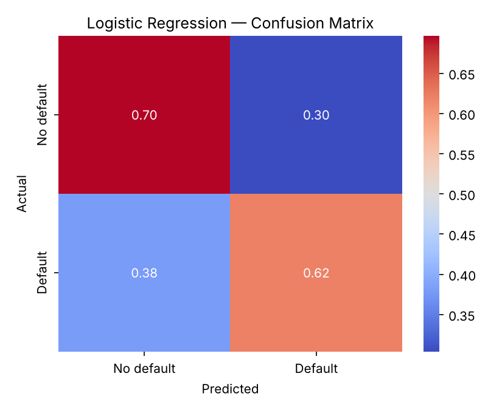
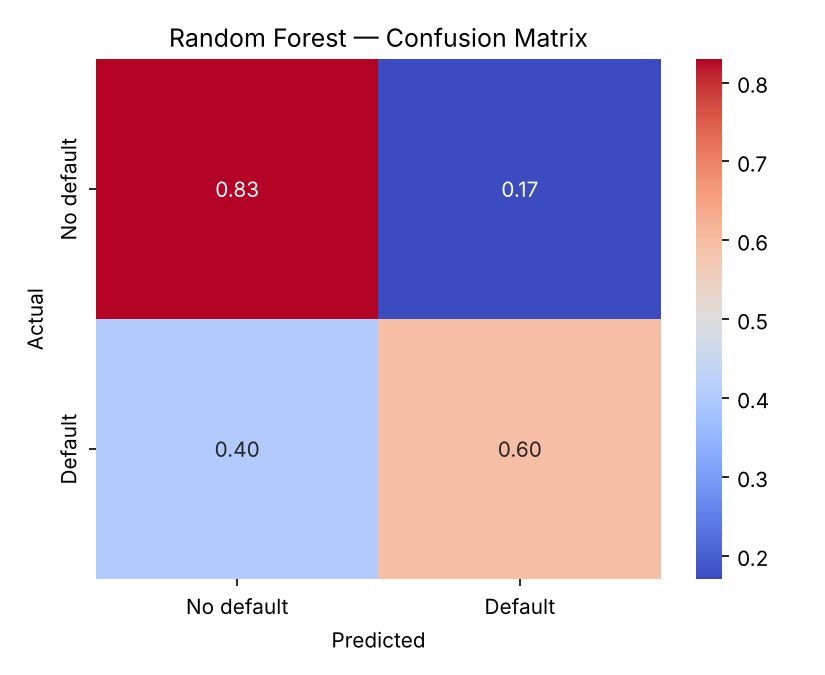
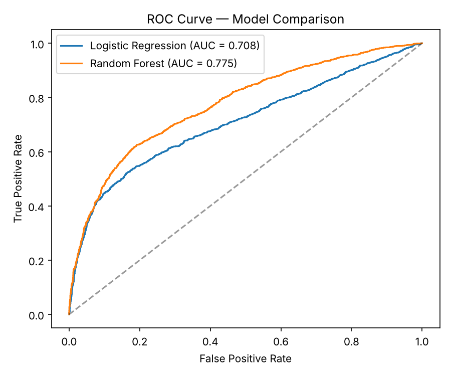
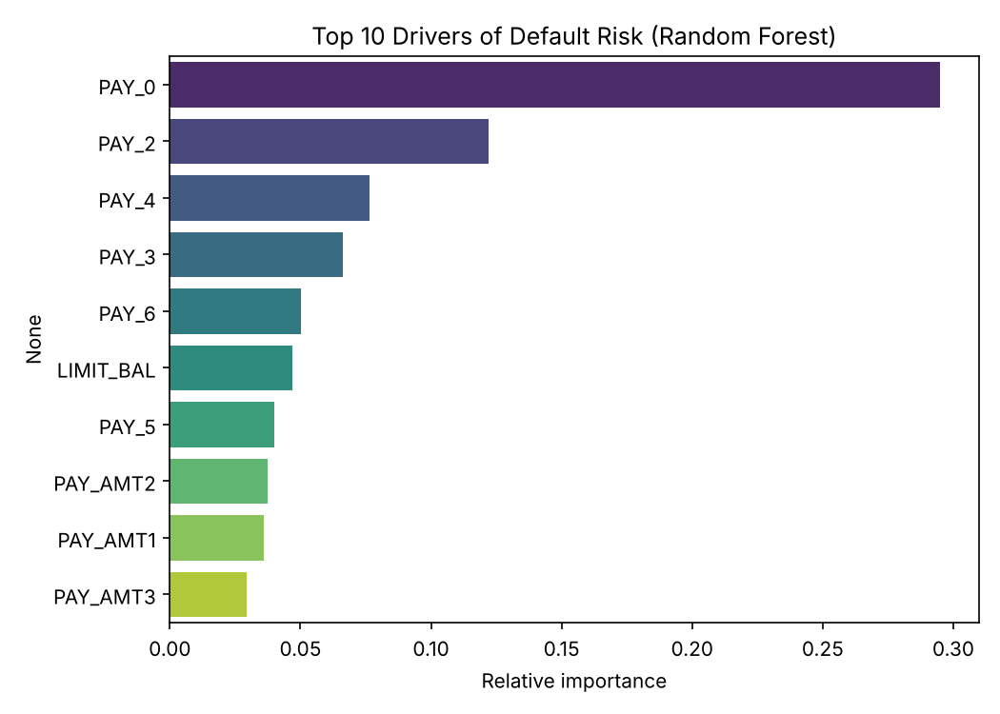
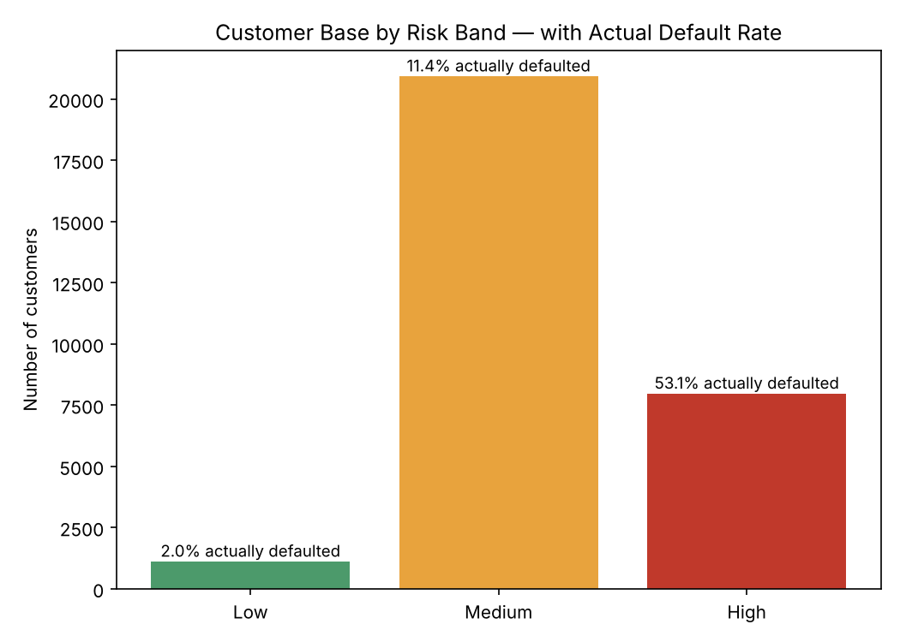

# Credit Card Default Risk Prediction

Predicting which credit card customers are likely to default on their payment next month, and turning that prediction into a risk-band view a credit risk team could actually act on — not just a model accuracy score.

## The problem

A credit risk team needs to know, ahead of time, which customers are likely to miss payments — so they can adjust credit limits, flag accounts for review, or prioritise collections outreach before a default happens, not after. This project builds and compares two models for that, then converts the output into a segmentation a non-technical risk manager could use day to day.

## The data

**Source:** [UCI "Default of Credit Card Clients" dataset](https://archive.ics.uci.edu/dataset/350/default+of+credit+card+clients) — 30,000 credit card customers in Taiwan (2005), with credit limit, demographics, 6 months of repayment status, bill amounts, and payment amounts, plus whether they defaulted the following month.

**Class balance:** 22.1% of customers defaulted (6,636 of 30,000) — a real-world imbalance, though much milder than the skin lesion project's.

**Cleaning:** `EDUCATION` and `MARRIAGE` both contained undocumented category codes (0, 5, 6 for education; 0 for marriage) outside what the dataset's own codebook defines — these were folded into an "other" category rather than dropped, to avoid losing ~1,300 customers' records.

## Approach

Two models, deliberately chosen to show the trade-off a risk team actually faces:

### Logistic Regression (interpretable baseline)
A standard, explainable model — the kind a risk team can justify to a regulator or auditor, since every coefficient has a clear direction and size.

**67.95% accuracy, 0.708 ROC-AUC.**



### Random Forest (stronger, less transparent)
An ensemble model that captures non-linear patterns logistic regression misses — at the cost of being harder to explain to a non-technical stakeholder.

**77.83% accuracy, 0.775 ROC-AUC** — a clear improvement, and the model used for the risk segmentation below.




**What actually drives the prediction:** the single biggest signal isn't credit limit or income — it's recent repayment history. `PAY_0` (most recent month's repayment status) alone accounts for ~29% of the model's decision-making, with the previous few months' repayment status close behind. In plain terms: **how someone paid last month predicts how they'll pay next month far more than who they are.**



## The result — a risk band a manager could use

A model accuracy score isn't something a risk manager acts on directly. So every customer was scored with the Random Forest model and bucketed into three risk bands:

| Risk band | Customers | Actual default rate |
|---|---|---|
| Low | 1,109 | 2.0% |
| Medium | 20,923 | 11.4% |
| High | 7,968 | 53.1% |



This is the actual business value: the "High" band is only 27% of the customer base, but it contains customers who default more than half the time — over 25x the rate of the "Low" band. A risk team could use this to prioritise review of the ~8,000 high-risk accounts rather than treating all 30,000 customers the same way.

## Key takeaway

The headline accuracy number (77.8%) undersells what this model is actually useful for. The real value is the *separation* between risk bands — being able to say "these 8,000 accounts default 53% of the time, these 1,100 almost never do" is a far more actionable output than a single accuracy figure, and it's the kind of output a credit risk team would actually build a process around.

## What I'd do next

- Try a gradient-boosted model (XGBoost/LightGBM) to see how much further the AUC can move
- Build this out as an interactive dashboard (Power BI or Tableau) so a risk manager could filter by risk band, credit limit, or demographic cut without touching code
- Test the model's fairness across demographic groups (sex, age, education) — an important check before any real deployment, not just an academic nicety

## Repo structure

```
credit-risk-default-prediction/
├── credit_risk_model.py          # full pipeline: cleaning, both models, risk segmentation, charts
├── data/
│   ├── UCI_Credit_Card.csv        # original dataset
│   └── customer_risk_scores.csv   # every customer scored + risk band (model output)
├── images/                        # generated charts
└── README.md
```

## Running it

```bash
pip install pandas numpy scikit-learn matplotlib seaborn
python credit_risk_model.py
```
